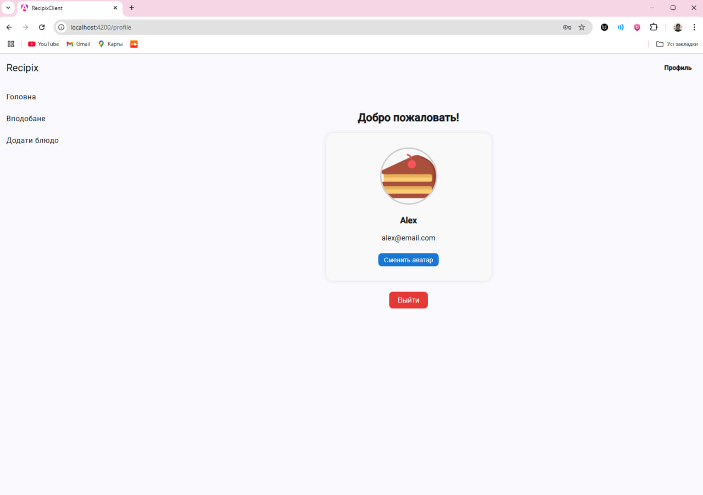
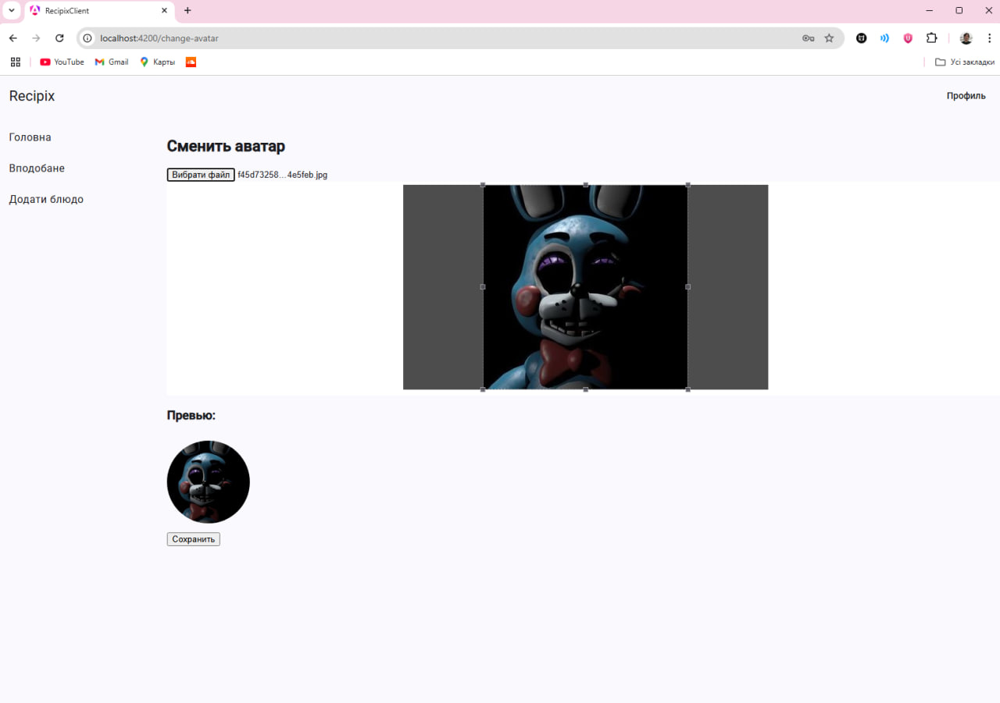
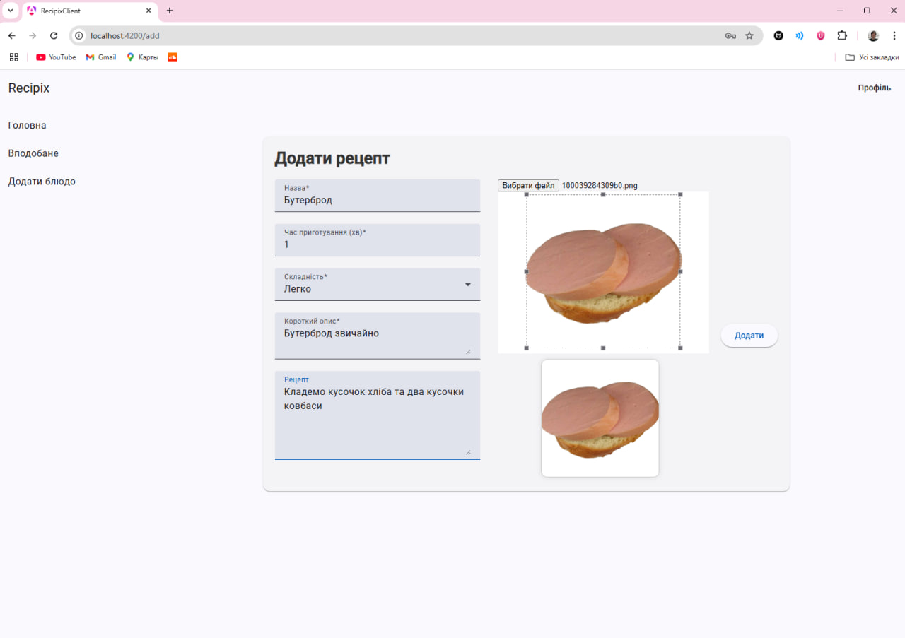
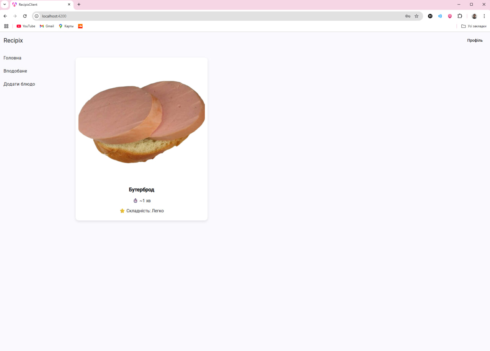
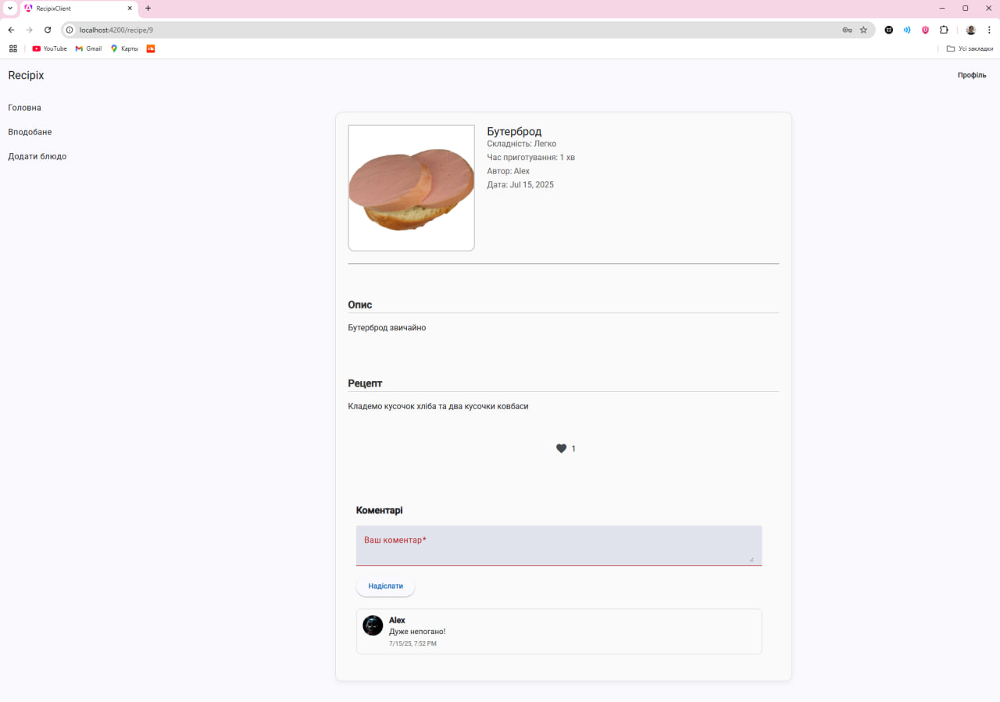
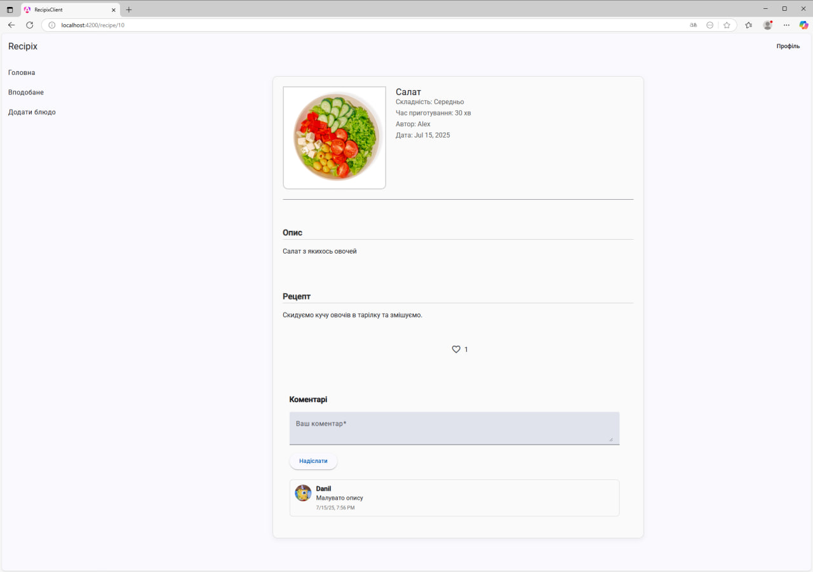
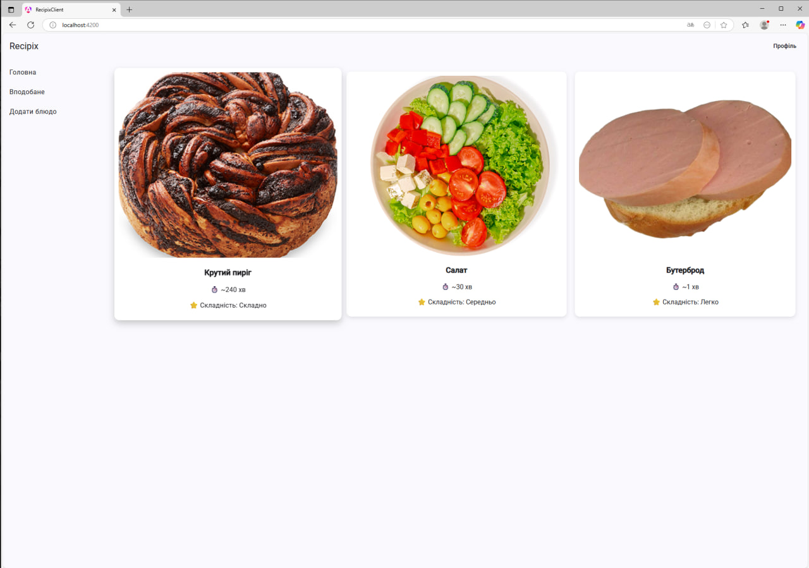
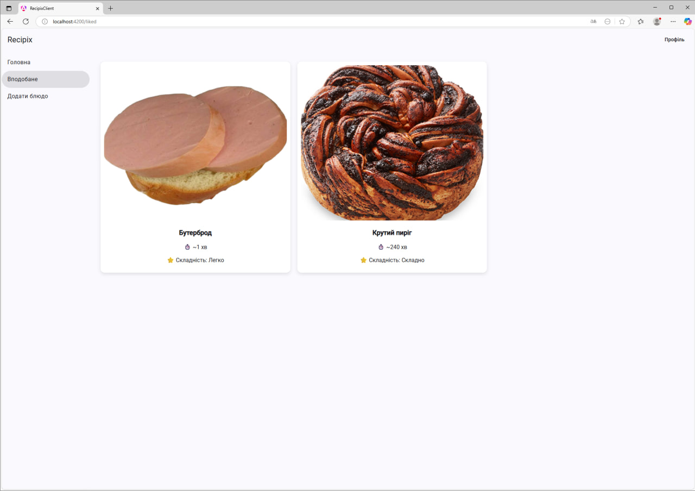
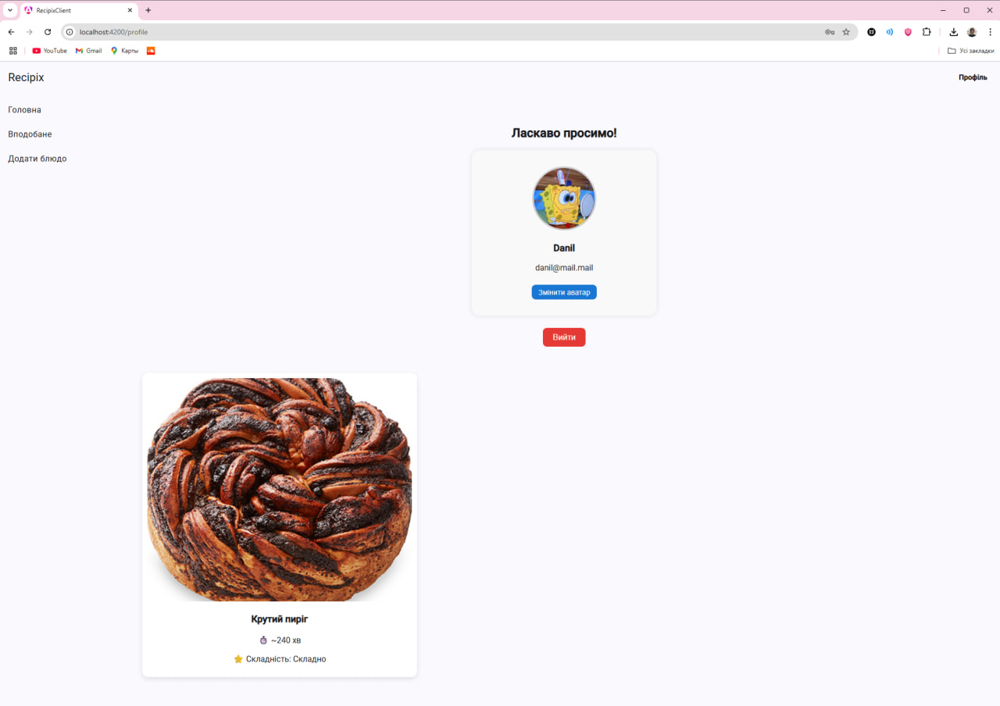
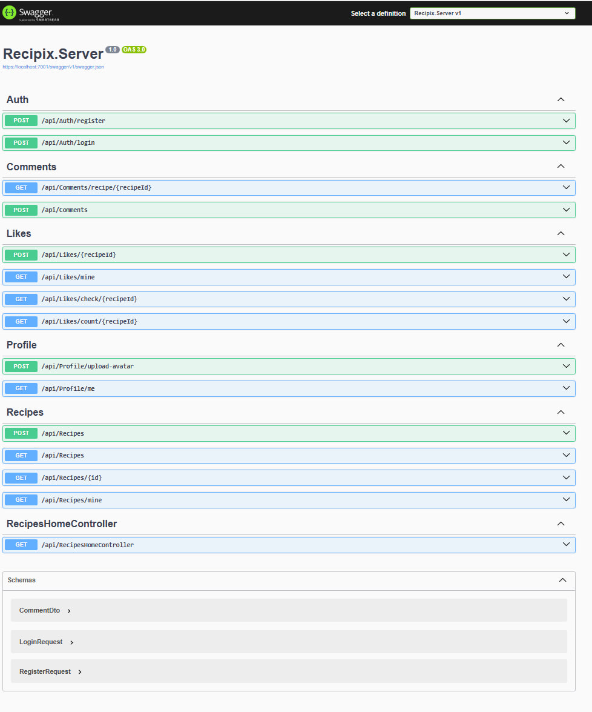

# Recipix
My pet-project on Angular 19 and .NET. Recipix is a site about food and recipes. Here you can share your recipes and read others. You can also register an account to have an opportunity to like and comment others recipes.

## Technologies Used

- ASP.NET Core Web API (C#)
- Angular 19
- Entity Framework Core (PostgreSQL)
- Docker (optional)
- JWT Authentication
- Angular Material
- ngx-image-cropper (for avatar and image uploads)

## Getting Started

- [.NET 8 SDK](https://dotnet.microsoft.com/en-us/download)
- [Node.js & npm](https://nodejs.org/en)
- [Angular CLI](https://angular.io/cli) `npm install -g @angular/cli`
- (Optional) [Docker Desktop](https://www.docker.com/products/docker-desktop/)

#### Backend (ASP.NET Core)

1. Open the solution `Recipix.sln` in **Visual Studio 2022+**
2. Set `Docker Compose` as **Startup Project**
3. Run the server
4. Ensure appsettings contains correct database config and JWT secret

Docker Compose used to lock ports for docker, if you run it locally you may face some troubles linked to backend switches ports every restart.

#### Frontend (Angular)

1. Open terminal inside `Recipix.Client` folder
2. Install dependencies:
   npm install
   ng server --port 4200
Use port 4200 to avoid acces issues.

# Screenshots

1. Clear account

2. Avatar change

3. Adding a new recipe

4. Home page with added recipe

5. Page of a recipe

6. Page of another recipe which is liked and commented by someone else

7. Home page with few recipes

8. Liked page

9. Profile page shows all your recipes

10. Swagger
